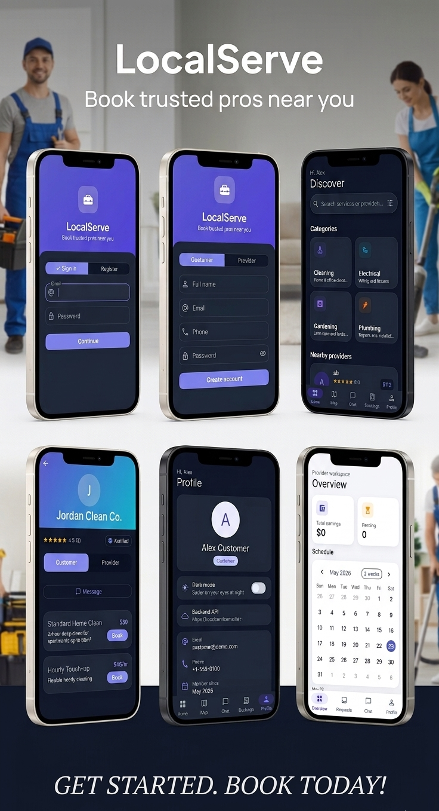

# LocalServe — Local Services Marketplace

<p align="center">
  
</p>

<p align="center">
  <strong>Book trusted pros near you.</strong><br />
  Cross-platform Flutter app · Node.js REST API · SQLite · Deployed on Render
</p>

---

## Features

| For customers | For providers |
|---------------|---------------|
| Browse categories & nearby providers | Dashboard & incoming booking requests |
| Provider profiles with ratings & reviews | Accept / reject requests |
| Book services & track status | Earnings & schedule overview |
| In-app chat with providers | Chat with customers |
| Map view · payments · reviews | Register with work categories |

**Also included:** light/dark theme · offline detection · JWT auth · production API on Render

---

## Quick start

### 1. Backend (optional — app uses Render by default)

```bash
cd backend
npm install
npm run seed    # first time only — demo users & providers
npm run dev     # http://localhost:3000
```

### 2. Flutter app

```bash
flutter pub get
flutter run
```

**Production API (default on Android/iOS):**  
`https://localservicemarket-api.onrender.com`

| Scenario | Command |
|----------|---------|
| Local API (emulator) | `flutter run --dart-define=API_BASE_URL=http://10.0.2.2:3000` |
| Offline mock (dev only) | `flutter run --dart-define=USE_MOCK_API=true` |
| Release APK | `flutter build apk --release` then `flutter install` |

> **Note:** Render free tier may take up to ~60s to wake on first request after idle. Stay on the screen or pull to refresh.

---

## Demo accounts

| Role | Email | Password |
|------|-------|----------|
| Customer | `customer@demo.com` | `password123` |
| Provider | `provider1@demo.com` | `password123` |
| Provider | `provider2@demo.com` | `password123` |

New providers can register in the app and select **work categories**; they appear in customer discovery after signup.

---

## Project structure

```
lib/                 Flutter — Clean Architecture, BLoC, get_it
  presentation/      Auth, discovery, booking, chat, profile
  domain/            Entities & repository contracts
  data/              REST (Dio) + optional mock datasource
backend/             Express API, SQLite, JWT
assets/              App icon & promo artwork
```

---

## API overview

| Area | Endpoints |
|------|-----------|
| Auth | `POST /api/v1/auth/login` · `register` · `GET /auth/me` |
| Discovery | `GET /categories` · `services` · `providers/nearby` · `providers/:id` · `providers/:id/reviews` |
| Chat | `GET/POST /conversations` · `GET/POST /conversations/:id/messages` |
| Bookings | `GET/POST /bookings` · `PATCH /bookings/:id/status` · `start` · `complete` |
| Payments | `POST /payments` · `POST /payments/:id/process` |
| Reviews | `POST /reviews` · `GET /reviews/exists` |

Protected routes: `Authorization: Bearer <token>`

On first deploy, an **empty database is auto-seeded** with demo data (same accounts as above).

---

## Google Maps (Android)

Maps key is in `android/app/src/main/AndroidManifest.xml`. Enable **Maps SDK for Android** in [Google Cloud Console](https://console.cloud.google.com/) and restrict the key to package `com.localservicemarket.localservicemarket`.

---

## License

Private / educational use — adjust as needed for your deployment.
